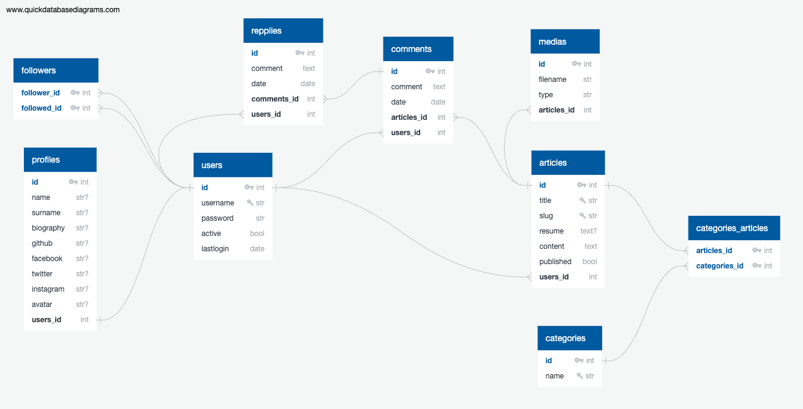

# Blog API with Flask and PostgreSQL

1. Diagrama Entidad Relacion



2. Modulos a Instalar
    - flask
    - flask-sqlalchemy
    - flask-migrate
    - flask-cors
    - flask-jwt-extended
    - python-dotenv
    - psycopg2-binary

3. Entorno Virtual

- Crear y activar entorno virtual

```shell
pipenv shell
```

- Instalar modulos

```shell
pipenv install flask flask-sqlalchemy flask-migrate flask-cors python-dotenv psycopg2-binary
```

4. Generar y Ejecutar Migraciones

- activar comando flask en el terminal

Windows
```shell
SET FLASK_APP=src/app.py
```

Linux o Mac
```shell
export FLASK_APP=src/app.py
```

- Creacion y Ejecucion de las migraciones

Este comando solo lo ejecutamos la primera vez si no existe la carpeta ***migrations***
```shell
flask db init
```

Crear las migraciones
```shell
flask db migrate
```

Actualizamos la base de datos con las migraciones

```shell
flask db upgrade
```
